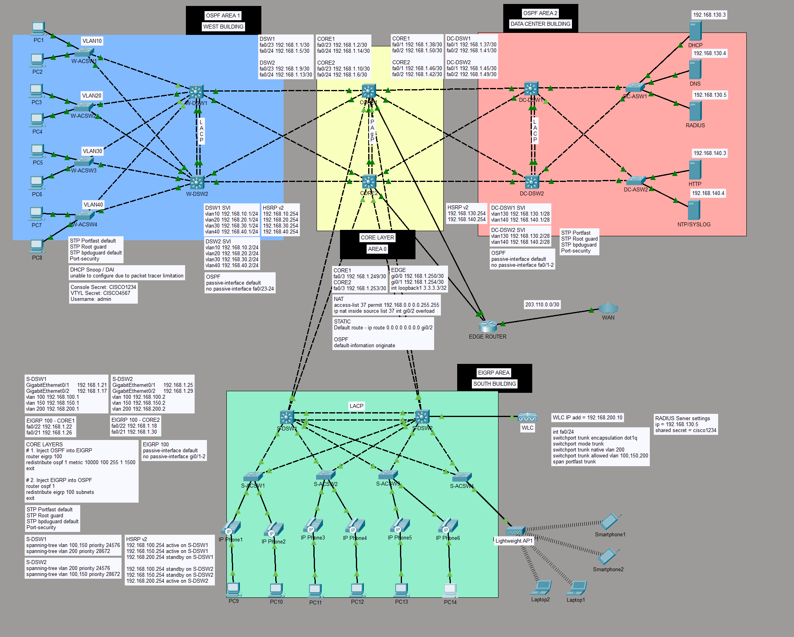
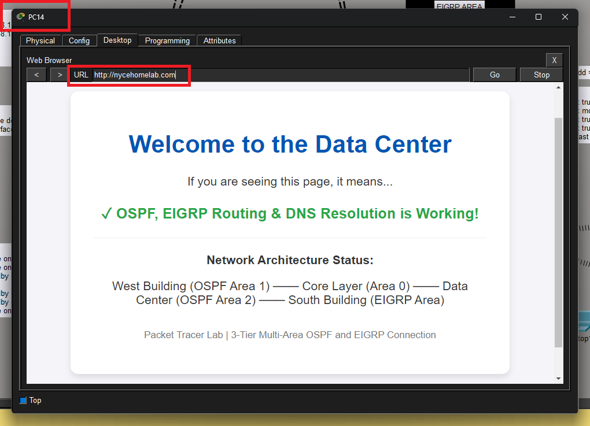

# Enterprise Network Topology Simulation

Welcome to my Cisco Packet Tracer Network lab! This project is a comprehensive simulation of an enterprise-grade network topology that I designed and configured using **Cisco Packet Tracer**. 

Building this topology was an incredible learning experience that allowed me to transition theoretical networking concepts into a fully functional, complex simulation. I implemented multi-area routing, high availability, redundancy, and strict security measures across different simulated corporate buildings.

If you are currently studying for your CCNA, exploring enterprise networking, or just looking for a comprehensive lab to study and replicate, feel free to dive into the details below!

---

## Network Architecture

* **West Building (OSPF Area 1):** Focuses on campus user access with ***multiple VLANs*** (VLAN 10, 20, 30, and 40) separating different departments.
* **Core Layer (OSPF Area 0):** The high-speed backbone connecting all buildings, ***managing redistribution***, and handling Network Address Translation (NAT) for internet-bound traffic.
* **Data Center Building (OSPF Area 2):** Houses critical enterprise servers (DHCP, DNS, RADIUS, HTTP, and NTP/Syslog) with dedicated high-availability paths.
* **South Building (EIGRP Area):** An independent building network utilizing ***EIGRP routing***, integrated with a Wireless LAN Controller (WLC) and Lightweight Access Points for Wi-Fi and IP Phone connectivity.

---

## Key Technical Highlights & Engineering Decisions

While building this, I ran into a few platform limitations within Packet Tracer, which forced me to get creative with my configurations. Here are the core implementations I am most proud of:

### 1. Smart Traffic Load Balancing (HSRP + STP Tuning)
> **The Challenge:** I wanted to use GLBP (Gateway Load Balancing Protocol) to dynamically balance traffic across my redundant distribution switches. However, Packet Tracer does not support GLBP.
>
> **The Workaround:** To achieve true load balancing without GLBP, I manually paired **HSRP v2** with **Spanning Tree Protocol (STP)** priority tuning. 
* I configured **DSW1** to be the Primary STP Root Bridge and Active HSRP Gateway for **VLAN 10 and 150**.
* I configured **DSW2** to be the Primary STP Root Bridge and Active HSRP Gateway for **VLAN 100 and 200**.
* This ensures that traffic from half the VLANs naturally flows through one switch, while the other half flows through the second, utilizing both hardware paths effectively while keeping a solid failover plan.

### 2. Optimizing Overhead with Passive Interfaces
To prevent unnecessary processing overhead, I heavily utilized the `passive-interface` command across the OSPF and EIGRP routing protocols. By blocking routing updates from being broadcasted down to end-user devices (like PCs, IP Phones, and Laptops), I ensured that:
* End devices aren't constantly processing useless routing packets.
* Network bandwidth is preserved.
* The network is more secure against rogue routers trying to form adjacencies on user ports.

### 3. Route Redistribution
Because the South Building relies on **EIGRP 100** and the rest of the network operates on **OSPF 1**, I configured mutual route redistribution at the Core Layer. I carefully injected OSPF routes into EIGRP (defining explicit metrics) and EIGRP subnets back into OSPF, establishing flawless end-to-end communication across the entire enterprise.

### 4. Link Aggregation & Security
* **LACP & PAgP:** Implemented EtherChannel across distribution and core switches to maximize bandwidth and provide link-level redundancy.
* **Switchport Security:** Enabled `STP Portfast`, `Root Guard`, and `BPDU Guard` alongside strict standard Port-Security mac-address limits on user-facing access ports to mitigate layer-2 attacks.

---

## Lessons Learned

* **Design for Limitations:** Working within Packet Tracer taught me that a good network engineer can achieve enterprise goals (like load balancing) even when their preferred protocol isn't supported by the hardware.
* **Documentation is Key:** Labeling subnets, IP assignments, and routing boundaries directly on the workspace layout saved me hours of troubleshooting when debugging routing loops and asymmetric routing paths.

## Verification & Proof of Connectivity

To verify full end-to-end routing, core services, and mutual redistribution, an HTTP request was initiated from **PC14** (located deep within the **EIGRP South Building** network). 

As demonstrated above, the host successfully resolved the domain `http://nycehomelab.com` and pulled the hosted page from the HTTP Server inside **OSPF Area 2 (Data Center Building)**. This confirms that:
* **EIGRP 100 to OSPF 1 Mutual Redistribution** is operational at the Core.
* **DNS Name Resolution** is working across routing boundaries.
* **End-to-End Routing** and security paths are flawlessly aligned.

---

## Detailed Technical Implementation

| Technology Category | Feature | Implementation Details |
| :--- | :--- | :--- |
| **Dynamic Routing** | Multi-Area OSPF & EIGRP 100 | Configured **OSPF Area 0 (Core)**, **Area 1 (West Bldg)**, and **Area 2 (Data Center)** for scalable routing. Implemented **EIGRP 100** in the South Building with mutual route redistribution at the Core. |
| **Routing Optimization** | Passive Interfaces & Default Route | Optimized using `passive-interface default` to block routing overhead from reaching end-user devices. Core routers utilize `default-information originate` to propagate the internet path. |
| **Switching Redundancy** | STP Tuning & EtherChannel | Layer 2 loop prevention using Spanning Tree (`Portfast`, `Root Guard`, `BPDU Guard`). Bundled redundant links into **LACP** (West/Data Center) and **PAgP** (Core) for maximum bandwidth. |
| **Gateway Redundancy** | HSRP v2 Load Balancing | Acted as a workaround for the lack of GLBP in Packet Tracer. Manually adjusted STP priorities and HSRP Active/Standby roles across Distribution Switches (**DSW1/DSW2** and **DC-DSW1/DC-DSW2**) to manually balance VLAN traffic. |
| **Network Security** | Layer 2 & Device Hardening | Enforced `Port-Security` at the access layer. Secured management lines with Console and VTY secrets (`CISCO1234` / `CISCO4567`). |
| **Boundary Protocols** | NAT / PAT & Static Routing | Implemented NAT Inside/Outside overloading on the Edge Layer to safely map internal corporate traffic out to the WAN interface (`203.110.0.0/30`). |
| **Core & Wireless Services** | Enterprise Infrastructure | Integrated a Wireless LAN Controller (**WLC**) via a native management VLAN (VLAN 200) to manage Lightweight Access Points, alongside centralized **DHCP, DNS, RADIUS, HTTP, and NTP/Syslog** servers. |

---

## How to Explore or Replicate This Lab

1. **Clone or Download:** Grab the `.pkt` file from this repository.
2. **Launch:** Open it using **Cisco Packet Tracer** (v8.0 or higher recommended).
3. **Verify Configurations:** * Run `show ip route` to check the OSPF routing table.
   * Run `show standby brief` to inspect active/standby HSRP states.
   * Run `show etherchannel summary` to verify bundled trunk lines.
4. **Test Connectivity:** Try pinging from a Campus Client PC to the Data Center HTTP Server or simulating a link failure to watch the network automatically self-heal via RPVST+ and HSRP

---

I built this lab as part of my deep-dive journey into networking engineering. If you are preparing for your CCNA or working on your own portfolio projects, feel free to fork this repository

## *Happy Labbing!*

